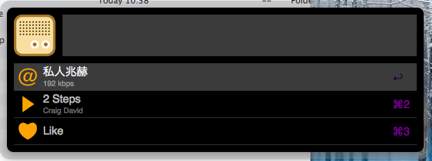
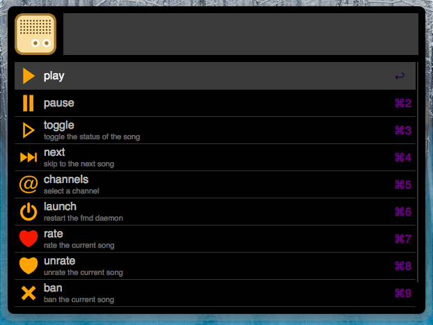
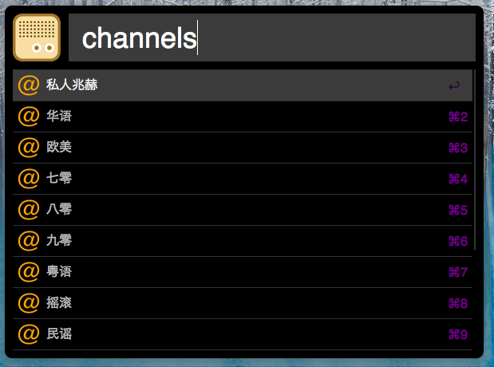

DoubanFM-Alfred 
==============

[DoubanFM-Alfred](https://github.com/yulan6248/DoubanFM-Alfred) is an Alfred extension that provides a full Douban.FM control interface (on the keyboard). 

Commands
--------

The command set mainly comes from that of [fmc]. Some additional commands include

- `quality <64/128/192>` change the bitrate of the music (will restart the `fmd` daemon); this only ever makes sense for paid users of Douban.FM
- `launch` launch the `fmd` daemon

If you are unsure about what commands to enter, you can input a space after the keyword of this extension; that will bring up the whole list of commands. A demo screenshot can be seen in the next [section](#commands).

Screenshots
-----------

Installation
------------

First you need to make sure you have [Alfred2](http://www.alfredapp.com/) with [Powerpack](http://www.alfredapp.com/powerpack/).

Then you need to install [fmd](https://github.com/hzqtc/fmd) and [fmc]. Follow the installation guideline for both programs.

After that you can download the binary version of this extension using this [link](https://github.com/yulan6248/DoubanFM-Alfred/raw/master/DoubanFM.alfredworkflow) or if you're a developer you can clone this repo and play around with the files to your heart's content.

Set a keyboard shortcut inside the workflow editor window if you feel like that.

**Note** : If you store your `fmd` and `fmc` at custom locations other than `$PATH`; please remember to edit the two variables `FMD_BIN` and `FMC_BIN` in the script filter.

Contact
-------

I understand that there might be bugs regarding this extension, please head on to [Issues](https://github.com/yulan6248/DoubanFM-Alfred/issues) if you encounter any.

[fmc]: https://github.com/hzqtc/fmc
